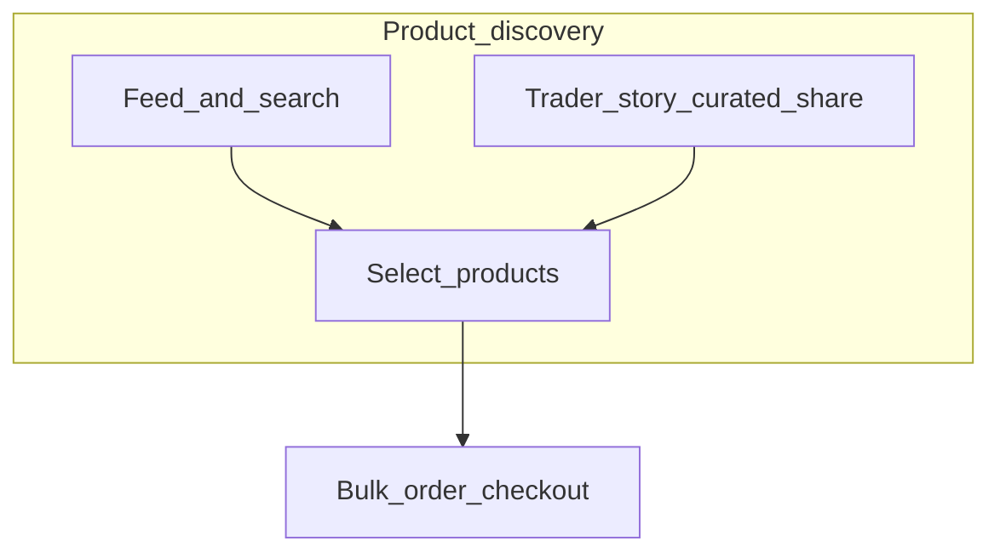
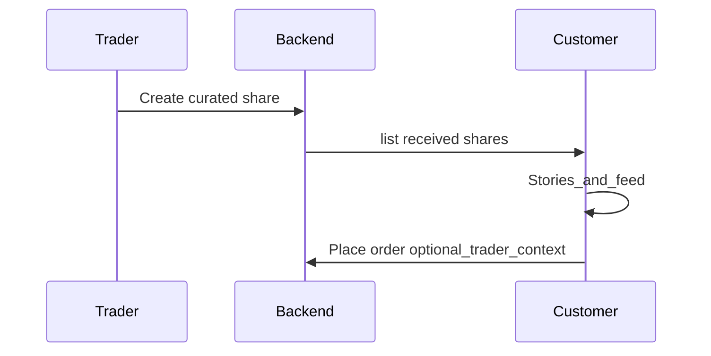
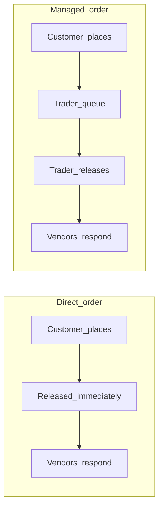
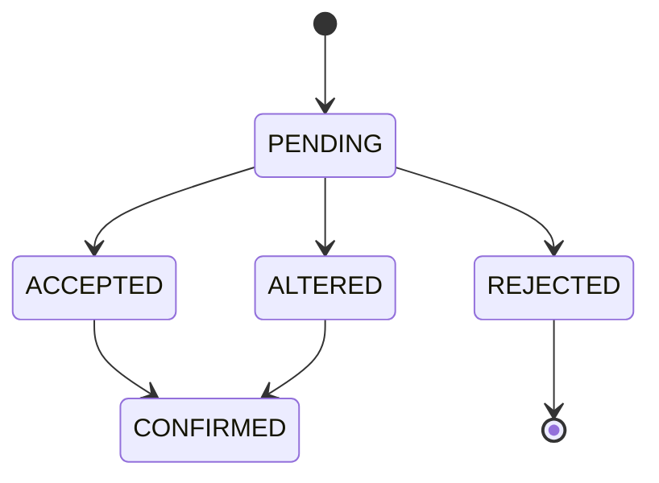
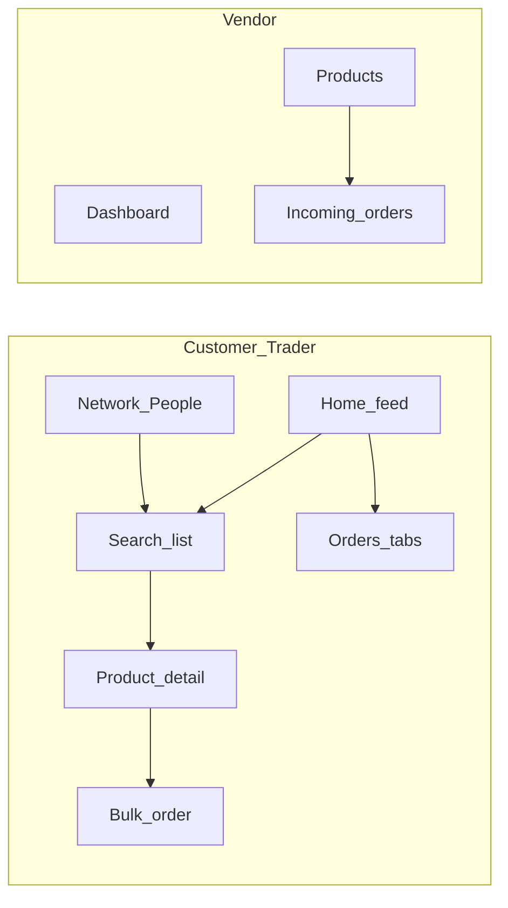

# GarmentHub — structured project description

## What it is

**GarmentHub** is a B2B-style garment marketplace / order platform connecting **buyers (customers)**, **traders** (curators / intermediaries), and **vendors** (suppliers). **Admins** manage users and catalog settings. The app supports **direct** orders (customer ↔ vendor) and **managed** orders (trader in the middle, with optional release to vendors).

Monorepo: [package.json](../package.json) workspaces `packages/backend` and `packages/frontend`.

---

## Tech stack

| Layer | Choice |
|--------|--------|
| API | Node + Express + TypeScript ([packages/backend/src/index.ts](../packages/backend/src/index.ts)) |
| Data | PostgreSQL + Prisma ([packages/backend/prisma/schema.prisma](../packages/backend/prisma/schema.prisma)) |
| Auth | Phone + OTP ([packages/backend/src/services/auth.service.ts](../packages/backend/src/services/auth.service.ts), [packages/backend/src/services/otp.service.ts](../packages/backend/src/services/otp.service.ts)) |
| Web app | React + Vite + TypeScript + React Router + TanStack Query ([packages/frontend/src/App.tsx](../packages/frontend/src/App.tsx)) |
| Media | Uploaded files under configurable paths; client resolves URLs via [packages/frontend/src/utils/mediaUrl.ts](../packages/frontend/src/utils/mediaUrl.ts) (`VITE_PUBLIC_API_ORIGIN` when UI and API differ) |

---

## Roles and routing

Roles in Prisma: `CUSTOMER`, `VENDOR`, `TRADER`, `ADMIN`.

- **Default home** `/`: vendors → `/vendor`, admins → `/admin`, others → customer/trader home ([packages/frontend/src/App.tsx](../packages/frontend/src/App.tsx) `RoleRedirect`).
- **Shared shell**: bottom nav / layout via [packages/frontend/src/components/layout/AppShell.tsx](../packages/frontend/src/components/layout/AppShell.tsx).

Major **customer/trader** routes: `/` (feed), `/search`, `/products/:id`, `/bulk-order`, `/orders`, `/orders/:id`, `/network` (People), `/saved`, `/notifications`, `/profile`, `/trader/share`.

**Vendor** routes (guarded): dashboard, brands, products CRUD, upload, incoming orders, history, catalog.

**Admin**: dashboard, users, orders overview, category settings.

---

## Core domain (data model)

High-level entities in [packages/backend/prisma/schema.prisma](../packages/backend/prisma/schema.prisma):

- **User** — phone login, role, business profile, invite code, follow graph via `Connection`.
- **Category / CategoryAttribute / VendorCategoryAttribute** — taxonomy and per-vendor attribute names.
- **Brand**, **Product** — vendor-owned catalog; optional `traderId`; `images` string array; workflow ties via `UserProductState`.
- **Order** — `customerId`, optional `traderId`, `orderMode` (`DIRECT` | `MANAGED`), `status`, `note`, **`customerNeedBy`** (optional deadline, end-of-day UTC), **`releasedToVendorsAt`** (managed: when vendors see lines).
- **OrderItem** — line-level negotiation: `PENDING` / `ACCEPTED` / `REJECTED` / `ALTERED` / `CONFIRMED`, quantities, prices (vendor offer, trader targets/counters, agreed).
- **CuratedShare** + recipients + products — trader “share” collections to customers (`orderMode` on share).
- **UserProductState** — trader/customer workflow: `UNSEEN` → `SEEN` → `SHARED` / `ORDERED` / `SKIPPED`.
- **Notification**, **SavedProduct**, **OtpStore**.

---

## System workflows

This section is the **operational picture**: how work moves between roles. UI copy and tab logic largely follow [packages/frontend/src/lib/orderWorkflow.ts](../packages/frontend/src/lib/orderWorkflow.ts).

### A. Product discovery (customer & trader home)

Customers and traders browse a **feed** built from **followed network** (traders → vendors) plus **curated share** products. Each product can have per-user **workflow state**:

| State | Meaning (simplified) |
|--------|----------------------|
| `UNSEEN` | In feed, not yet marked seen |
| `SEEN` | Viewed; still deciding |
| `SHARED` | Customer shared / trader marked shared (per product lifecycle) |
| `ORDERED` | Bought via an order |
| `SKIPPED` | Dismissed |

**Trader home** uses the same state machine in tabs (e.g. Recent / Pending / Shared / Done / Skipped) via the workflow API; **customer home** mixes infinite **feed** pagination with **trader story circles** (curated shares).

### B. Curated share (trader → customer)

1. Trader builds a **CuratedShare** (product lines + recipients + optional `orderMode` DIRECT/MANAGED).
2. Customer sees it in **stories** and feed; checkout can carry **trader context** (managed vs direct) from the latest relevant share.
3. **People / Network** can show **My Traders** with thumbnails from received shares.

### C. Order modes: direct vs managed

| Mode | Who sees the order first | When vendors see lines |
|------|---------------------------|-------------------------|
| **DIRECT** | Customer order; `releasedToVendorsAt` set at create | Immediately (vendors notified) |
| **MANAGED** | Customer order tied to a **trader** | Only after trader **releases** (`releasedToVendorsAt` set) |

Until release on managed orders, vendors **do not** see line items; the customer sees **“Pending from trader”** (trader must review and send).

### D. Line items (negotiation)

Each **OrderItem** has its own status; the **order** header aggregates outcome.

**Line statuses:** `PENDING` → vendor may set `ACCEPTED`, `REJECTED`, or `ALTERED` (counter: qty/price). After vendor action, the customer may **confirm** the basket so lines can move to `CONFIRMED` and the order toward **CONFIRMED**.

Pricing fields on a line include vendor offer, trader target/counter (managed or pre-vendor), and agreed unit price once settled.

### E. Order header status (coarse)

Typical **Order.status** values: `PENDING`, `ACCEPTED`, `PARTIALLY_ACCEPTED`, `REJECTED`, `CONFIRMED`, `CANCELLED`. The UI **“Pending from me”** tab does **not** mirror this field alone: it uses **`isPendingActionFromViewer`**:

- **Customer:** `actionRequired` from `getCustomerOrderDecisionLabel` — mainly **confirm or adjust** after vendors responded (no lines still `PENDING`).
- **Trader:** managed orders **before** `releasedToVendorsAt` — **review and send to vendors**.

Other tabs on the Orders page group by coarse status (e.g. **Waiting** = order still `PENDING`, **Done** = accepted/confirmed family, **Cancelled** = rejected/cancelled).

### F. Customer-facing order stages (mental model)

As implemented in `getCustomerOrderDecisionLabel`:

1. **Confirmed** / **Cancelled** / **Not fulfilled** — terminal-style outcomes.
2. **Pending from trader** — managed, not yet released to vendors.
3. **Pending from vendors** — at least one line still `PENDING` after release (or direct flow).
4. **Pending from me** — customer must **confirm** supplier responses (accept/alter mix, no pending lines).
5. **In progress** — fallback.

### G. Trader-facing order stages (mental model)

As implemented in `getTraderOrderStage`:

1. **Complete** — buyer confirmed.
2. **Pending from me** — managed, must release to vendors.
3. **Pending from vendors** — waiting on supplier responses (with substates for “all pending” vs partial).
4. **Pending from customer** — responses in; buyer must confirm.
5. **Managed / Direct — monitoring** — no immediate blocker.

### H. Need-by (vendor urgency)

Optional **customerNeedBy** (date-only from client; stored as **end of that UTC day**). Vendors see **Urgent** (within 48h of deadline) or **Overdue** (past deadline), not “order age”. Logic: `getCustomerNeedByUrgency` in `orderWorkflow.ts`.

---

## Backend modules (by concern)

Rough map under [packages/backend/src](../packages/backend/src):

- **Auth** — `auth.routes`, `auth.controller`, `auth.service`, JWT middleware [packages/backend/src/middleware/auth.ts](../packages/backend/src/middleware/auth.ts).
- **Products** — listing, filters, feed (customer network + curated scope), categories, saved products [packages/backend/src/services/product.service.ts](../packages/backend/src/services/product.service.ts).
- **Orders** — create (with optional `customerNeedBy`), list by role, vendor responses, trader actions, notifications [packages/backend/src/services/order.service.ts](../packages/backend/src/services/order.service.ts).
- **Curation** — create share, list sent/received, mark read [packages/backend/src/services/curation.service.ts](../packages/backend/src/services/curation.service.ts).
- **Workflow** — unseen/seen feeds and counts for traders [packages/backend/src/services/workflow.service.ts](../packages/backend/src/services/workflow.service.ts).
- **Network** — search users, follow/unfollow, stories/suggestions [packages/backend/src/services/network.service.ts](../packages/backend/src/services/network.service.ts).
- **Vendor / Admin / Brand / Upload** — vendor catalog and product ops; admin user/order/category tooling; file uploads [packages/backend/src/config/uploadPaths.ts](../packages/backend/src/config/uploadPaths.ts).

API shape: shared success wrapper [packages/backend/src/utils/apiResponse.ts](../packages/backend/src/utils/apiResponse.ts); validation via DTOs (Zod) and [packages/backend/src/middleware/validate.ts](../packages/backend/src/middleware/validate.ts).

---

## Frontend — main user journeys

- **Home** ([packages/frontend/src/pages/customer/Home.tsx](../packages/frontend/src/pages/customer/Home.tsx)): customer feed (infinite `feed` API + curated “stories”); trader workflow tabs and unseen grouping; **category chips filter in place** with `categoryId` on `/products/feed`; optional search-in-grid.
- **Checkout** ([packages/frontend/src/pages/customer/BulkOrder.tsx](../packages/frontend/src/pages/customer/BulkOrder.tsx)): line quantities, managed/direct mode from selection store; **optional need-by date** via hidden date input + `showPicker`, sent as `YYYY-MM-DD`.
- **Orders** ([packages/frontend/src/pages/customer/Orders.tsx](../packages/frontend/src/pages/customer/Orders.tsx)): tabs include **Pending from me**, **Waiting**, **Done**, **Cancelled**; **smart default tab** (`activeTab === null` + `smartTabIndex`) avoids wrong first paint; empty “Pending from me” uses **Waiting** messaging.
- **Vendor incoming** ([packages/frontend/src/pages/vendor/IncomingOrders.tsx](../packages/frontend/src/pages/vendor/IncomingOrders.tsx)): **Urgent / Overdue** from `customerNeedBy` via [packages/frontend/src/lib/orderWorkflow.ts](../packages/frontend/src/lib/orderWorkflow.ts) `getCustomerNeedByUrgency` (not age-based).
- **People / Network** ([packages/frontend/src/pages/Network.tsx](../packages/frontend/src/pages/Network.tsx)): **My Traders** thumbnails from curated shares; **thumb URL fallback** to full `mediaUrl` when `/uploads/thumbs/` missing.

Shared workflow labels/helpers: [packages/frontend/src/lib/orderWorkflow.ts](../packages/frontend/src/lib/orderWorkflow.ts) (customer decision labels, trader stage, pending-from-viewer, totals, need-by urgency).

---

## Cross-cutting behaviors worth documenting

1. **Need-by deadline** — Server stores end of chosen UTC day; validation in [packages/backend/src/dto/order.dto.ts](../packages/backend/src/dto/order.dto.ts); vendor list includes `customerNeedBy` on nested `order`.
2. **Feed category filter** — Query param `categoryId` on customer feed API; curated rows client-filtered by `product.categoryId`.
3. **Images** — Prefer thumbs in grids with **onError** fallback to full product path where implemented (e.g. `ProductCard`, Network trader strip).

---

## Ops / repo scripts

From root [package.json](../package.json): `backend:dev`, `frontend:dev`, `db:migrate`, `db:seed`, `db:generate` (wrappers to `packages/backend`).

---

This is a **description of the system as built in source**, not a roadmap. For product-spec detail, other notes under `Documents/` are separate from this technical overview.
